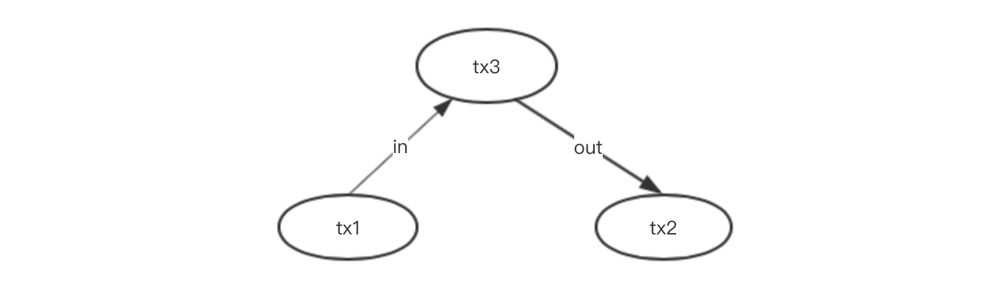
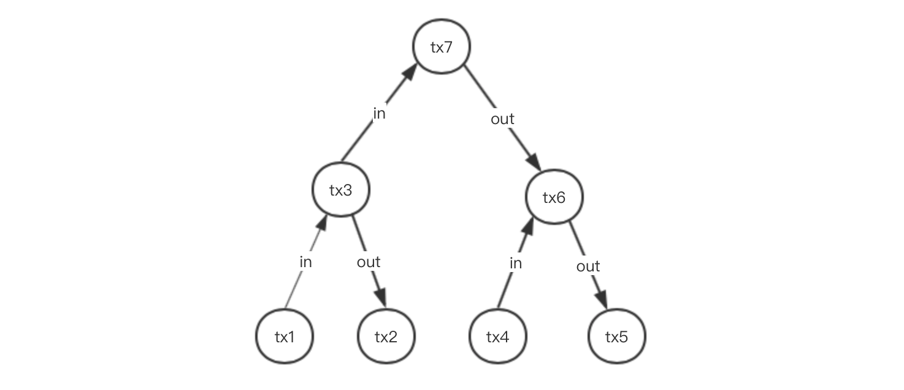

# XDAG技术详解1-概要

作者：社区成员Larry

## xdag是什么

根据社区网站xdag.io介绍，xdag是一种依据DAG模型实现的加密货币。

## xdag的目的

在比特币模式的区块链系统中，为了解决一致性问题，强制要求任一时刻只能有单个算力胜出块有效，导致系统吞吐量放在了一个单点上，其他并行跑的算力结点工作浪费了。

虽然这个单点可以变化，也可以增强，但是单点始终存在，对一个分布式系统来说，无法并行交易，对吞吐量来说是很致命的。

为了解决这个单点问题，业界提了很多方案，包括增大出块速度、加大块长、DAG模型。xdag是DAG模型中比较有特色的一个项目。

xdag项目有很多值得学习的地方，但是这个项目文档写的比较简单，很多特色概念都只是简单的讲了几句，很少有资料描述的比较清楚。本文的目的，就是把我自己学习中了解到的知识都整理出来，促进大家更快更好的了解xdag。

## xdag模型

在看xdag模型之前，我们先看一个传统的交易模型。

传统的交易模型非常好理解，一个transaction是从accout1向account2的一次转账。

在传统交易模型中，account与transacion是两个不同的概念，account是资金容器，transaction是转账流水。xdag创新性的把这两个概念合二为一，transaction就是account，或者说transaction的id可以当做account的id用。这样就导致上面的模型变成了下面的样子。

这个模型简称为**交易即账户**：

1. 每一个transanction在不同场景下有不同的角色。

   tx1和tx2是在tx3之前就存在的。

   在tx3创建的时候，tx1和tx2是account角色。

   在先前生成tx1和tx2的过程中，tx1和tx2本身是transaction角色。

2. transaction作为account角色时的余额从哪来？这有好几种情况会产生余额，拿tx3举例。

   1. 在tx3生成过程中，如果in的金额比out的金额大，那么in-out留下的金额，会加入到tx3作为account角色下的余额里去。
   2. 在tx3生成后，tx3从此会多了一个account角色，也就是说从此以后，tx3的id可以作为out的目标接收其他交易的转账了，这些转账的金额会加入到tx3作为account角色的余额里去。
   3. 还有一种特殊情况，如果tx3被系统判定为主块（挖矿导致的难度最大块），那么会被系统自动增加一个固定的金额到tx3作为account角色的余额里去。

**交易即账户**模型，是一个比较难理解的概念，与UTXO模型相同点是，新的交易需要把先前的UTXO交易当做输入，但不同点在于：

1. 比特币中的账户地址是独立的，与UTXO无关，xdag中直接用了交易块地址当做账户地址。
2. 比特币的UTXO模型要求，in和out必须相等，xdag要求in大于out+fee，多出来的就属于这个transanction账户。
3. 比特币中新的交易要用先前的UTXO做输入，但输出用的是账户地址，xdag需要先前的交易账户做输出。

所以在xdag中的，多个交易完成后的模型变成了下面这样：

在xdag中，属于自己的交易块地址才是账户地址，归属关系的判断与秘钥有关。用户可以有多个秘钥，也可以只有一个，不需要因为需要多个地址，就生成多个秘钥。

